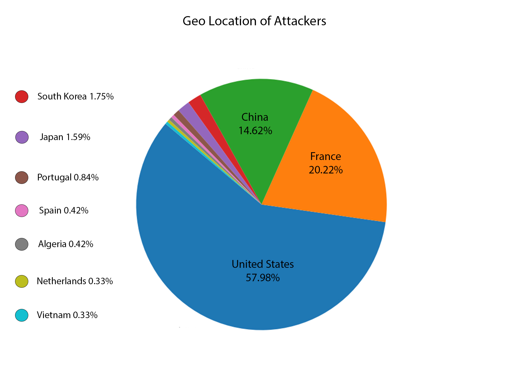
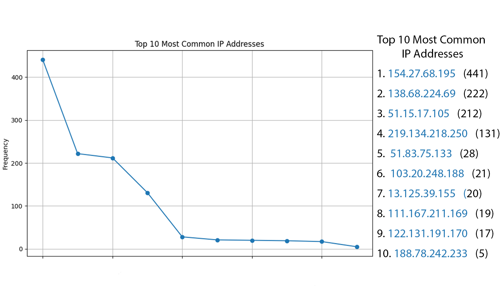
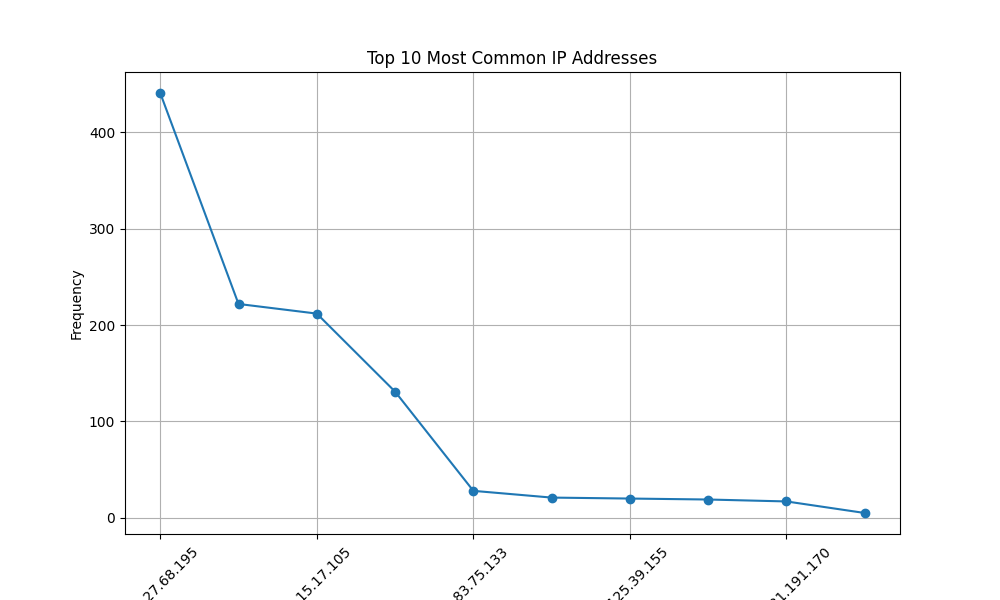

#   Honeypot Analysis Project

[Project .Doc](https://drive.google.com/file/d/1Lu85_wF507unT5HFtFPbNKBlrqTvCz4K/view?usp=sharing)


This repository contains our final year project on **Cyber-Attack Detection and Analysis using a Honeypot System**. Developed by [**Toyo Ntewo**](https://www.linkedin.com/in/toyontewo123/) and [**Aloba Suad**](https://www.linkedin.com/in/suad-aloba-1b3226335?utm_source=share&utm_campaign=share_via&utm_content=profile&utm_medium=android_app), this project implements a cloud-based honeypot system designed to capture and analyze attacker behaviors like Attackers Geo-location, Most frequent IP Addresses, Most common username and password used and Success rate.

## Project Overview

There is rapid advancement in cybersecurity threats, organizations are actively seeking ways to anticipate and counteract malicious activities. This project aimed to deploy a honeypot using the Cowrie framework to capture potential cyber-attacks in a controlled environment and analyze the collected data using Python and Pandas. Though we initially used a Linode server for hosting the Cowrie honeypot, our subscription expired, leading us to primarily focus on analyzing the attack logs.
[Project presentation Slides](https://drive.google.com/file/d/10o3Izb-WyGNJcPUHVLdyX3lZbYIXTmBa/view?usp=sharing)

### Key Features

- **Honeypot Deployment**: The Cowrie honeypot simulated an SSH environment, recording various attacker attempts.
- **Data Collection**: [Logs](all_files/files/cowrie_log.csv) from the honeypot included timestamps, IP addresses, login attempts, and success/failure statuses.
- **Data Analysis**: Using Python and Pandas, we performed in-depth analysis, extracting insights on attacker trends, including geographic origin, common usernames, passwords, and IP addresses used in brute-force attacks.

## Project Structure

- **/logs**: Directory for storing raw honeypot logs.
- **/analysis**: Python scripts and Jupyter notebooks used for data cleaning, analysis, and visualization.
- **/docs**: Documentation on the [Cowrie honeypot setup](https://docs.google.com/document/d/1I4xrF-5Ahn0B2d3-KERN1xMbh3BVx21xKF9nCa_1wX0/edit?usp=sharing), cloud deployment, and analysis approach.

## Technologies Used

- **Python**: For log analysis (Pandas, Matplotlib).
- **Cowrie Honeypot**: Simulated SSH services to attract and log malicious activity.
- **Linode Cloud Server**: Used for initial deployment.

## Data Analysis and Findings

1. **Geographical Analysis**: The majority of attacks originated from countries X, Y, and Z. Using [Python](all_files/files/geo_piee.py)
   
2. **IP Frequency**: Specific IPs showed repeated login attempts, indicating potentially automated attacks.
   
   
4. **Username and Password Trends**: Common usernames like 'root' and 'admin' were frequently targeted, often paired with weak passwords.
   <br>
   

## Setup Instructions

### 1. Deploying Cowrie Honeypot

   - Clone the Cowrie repository:
     ```bash
     git clone https://github.com/cowrie/cowrie
     cd cowrie
     ```

   - Install dependencies and set up a virtual environment:
     ```bash
     virtualenv cowrie-env
     source cowrie-env/bin/activate
     pip install -r requirements.txt
     ```

   - Configure Cowrie:
     Edit `cowrie.cfg` to specify logging preferences and service ports.

### 2. Log Data Analysis

- Use the provided Jupyter notebooks in `/analysis` to preprocess, clean, and analyze the log data.
- Generate visualizations of attack patterns using Matplotlib.

## Results and Insights

Our analysis revealed significant trends in attacker behaviors, contributing to improved network defense strategies by anticipating common attack patterns.

## Future Work

Potential improvements include deploying additional honeypots to capture a wider variety of attacks and integrating machine learning models for predictive analysis.

## Contributors [](https://www.linkedin.com)

- [Ntewo Toyo](https://www.linkedin.com/in/toyontewo123/)
- [Aloba Suad](https://www.linkedin.com/in/suad-aloba-1b3226335?utm_source=share&utm_campaign=share_via&utm_content=profile&utm_medium=android_app)
